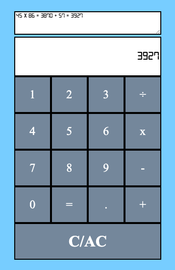

# Calculator-app

An easy to use calculator with a built in display screen that shows the user's computation history. Built with Javascript, HTML, and CSS

## Try it:
Try the calculator [here](https://dmalchowlfc.github.io/Calculator-app/)

## Calculator Screenshot:

## Summary:

This has been the most difficult project to date. There were several challenges along the way that really pushed the learning curve forward. Figuring out how to implement the decimal properly was the most rewarding part of this I feel. 

## Author: 
David Malchow - [LinkedIn](https://www.linkedin.com/in/david-malchow-809b106b/)
